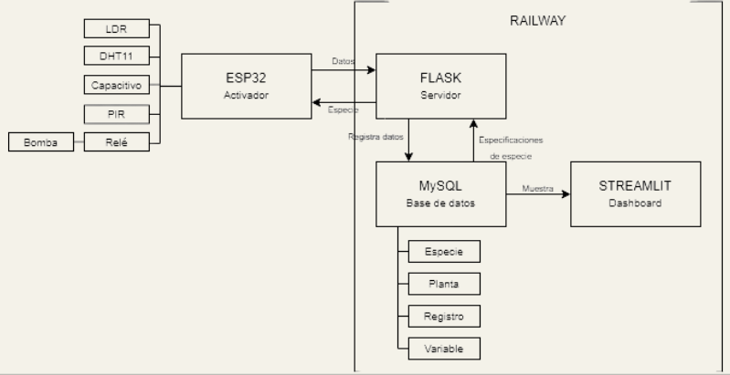

# 🌱 BloomJoy - Maceta Inteligente IoT


## Introducción

**BloomJoy** es un sistema de maceta inteligente IoT que monitorea las condiciones óptimas de una planta. El sistema captura datos ambientales en tiempo real (temperatura, humedad del aire, humedad del suelo, luz y movimiento) mediante sensores conectados a una ESP32, y ejecuta riego automático según parámetros configurables acorde al tipo de planta.

La arquitectura completa incluye:
- **Hardware IoT**: ESP32 con sensores (DHT11, sensor capacitivo de humedad del suelo, LDR, PIR) y relé para control de bomba de agua
- **Backend**: API REST en Flask para gestión de datos y configuración
- **Base de datos**: MySQL para almacenamiento persistente de lecturas y configuraciones
- **Dashboard**: Interfaz web interactiva en Streamlit para visualización y análisis de datos
- **Deployment**: Infraestructura desplegada en Railway para acceso remoto 24/7

🔗 **[Ver Dashboard en Vivo](https://bloomjoy-production-5716.up.railway.app/)**

---

## Componentes del Sistema

### **Backend (Flask API)** - `backend/app.py`

**Propósito**: Servidor REST que actúa como intermediario entre el ESP32 y la base de datos.

**Funcionalidades**:

- **`GET /config/<id_planta>`**: Devuelve la configuración de umbrales (temperatura, humedad, luz, riego) para una planta específica desde la tabla `especie_fake`
- **`POST /data`**: Recibe lecturas de sensores del ESP32 y las almacena en la tabla `registro`
- **Validación de alertas**: Compara valores recibidos con rangos configurados y genera alertas

**Archivos clave**:
- `app.py`: Lógica principal con rutas y conexión a MySQL
- `requirements.txt`: Flask==3.0.0, mysql-connector-python==8.2.0, gunicorn==21.2.0, python-dotenv==1.0.0
- `Procfile`: `web: gunicorn app:app` (comando de inicio para Railway)
- `.env`: Variables de entorno con credenciales de MySQL Railway

---

### **Dashboard (Streamlit)** - `dashboard/diseno.py`

**Propósito**: Interfaz web interactiva para visualización de datos en tiempo real.

**Funcionalidades**:

- **Página Overview**: Resumen de condiciones actuales, alertas, gráficos de tendencia, predicciones lineales
- **Páginas por sensor**: Visualizaciones específicas para Humedad de Suelo, Temperatura, Luz, Movimiento (PIR) y Humedad Ambiente
- **Auto-refresh**: Actualización automática cada 5 segundos usando `streamlit-autorefresh`
- **Filtros de fecha**: Análisis histórico con rango de fechas personalizable
- **Exportación**: Descarga de datos filtrados en formato CSV
- **Gráficos interactivos**: Plotly para series de tiempo, histogramas, boxplots, predicciones

**Archivos clave**:
- `diseno.py`: Dashboard principal con múltiples páginas y visualizaciones
- `dashboard.py`: Versión alternativa del dashboard
- `requirements.txt`: streamlit>=1.28.0, pandas, plotly, matplotlib, scikit-learn, mysql-connector-python, streamlit-autorefresh
- `bloomjoy.jpeg`, `samuel.png`, `bloomjoy.svg`: Recursos gráficos

**Conexión a datos**:
- Lee directamente de MySQL Railway (no pasa por Flask)
- Función `obtener_datos()`: Query SQL con PIVOT para agrupar lecturas por timestamp
- Función `obtener_configuracion()`: Lee umbrales desde `especie_fake` vía JOIN con `Planta`

---

### **Código ESP32 (Arduino)** - `sensors.ino`

**Propósito**: Firmware del microcontrolador que gestiona sensores, riego y comunicación HTTP.

**Hardware utilizado**:
- **ESP32**: Microcontrolador con WiFi integrado
- **DHT11** (pin 13): Sensor de temperatura y humedad del aire
- **Sensor de humedad de suelo** (pin 32): Sensor capacitivo/resistivo analógico
- **LDR** (pin 35): Fotorresistor para medición de luz ambiental
- **PIR** (pin 4): Sensor de movimiento pasivo infrarrojo
- **Relé** (pin 25): Control de bomba de agua para riego

**Flujo de operación**:

1. **Setup**: 
   - Conecta a WiFi (`iPhone` / `soymikel`)
   - Obtiene configuración inicial desde `GET /config/1`
   - Inicializa medianas con `RunningMedian` para filtrado de ruido

2. **Loop continuo**:
   - **Lectura de sensores** (cada 300ms): Actualiza medianas de temperatura, humedad, luz, humedad de suelo, PIR
   - **Control de riego** (timer configurable): Ejecuta pulsos inteligentes de 2 segundos hasta alcanzar `HumedadT_min` o máximo 5 pulsos
   - **Envío de datos** (cada 15 segundos): POST a `/data` con JSON de lecturas actuales
   - **Reconexión WiFi**: Detecta desconexiones y reconecta automáticamente

**Librerías utilizadas**:
- `WiFi.h`: Conectividad WiFi del ESP32
- `HTTPClient.h`: Cliente HTTP para peticiones REST
- `WiFiClientSecure.h`: Soporte HTTPS con SSL para Railway
- `ArduinoJson.h`: Parsing de respuestas JSON del servidor
- `RunningMedian.h`: Filtro de mediana para estabilizar lecturas
- `DHT.h`: Driver para sensor DHT11

**Configuración HTTPS**:
```cpp
WiFiClientSecure client;
client.setInsecure(); // Acepta certificado SSL de Railway
http.begin(client, url);
```

**Endpoint configurado**:
```cpp
String serverBase = "https://bloomjoy-production.up.railway.app";
```

---

### **Base de Datos MySQL** - `retodb.sql`

**Propósito**: Almacenamiento persistente de datos históricos y configuraciones.

**Tablas principales**:

**`variable`** - Catálogo de tipos de sensores
```sql
ID_variable | Nombre
------------|---------------
1           | Luz
2           | Temperatura
3           | Humedad
4           | HumedadTierra
5           | Movimiento
```

**`especie_fake`** - Configuración de umbrales por especie
```sql
ID_especie | Nombre  | HumedadT_min | HumedadT_max | Temperatura_min | Temperatura_max | ...
-----------|---------|--------------|--------------|-----------------|-----------------|----
1          | Tomate  | 30.0         | 60.0         | 10.0            | 33.0            | ...
```

**`planta`** - Instancias de plantas monitoreadas
```sql
ID_planta | ID_especie | Nombre
----------|------------|--------
1         | 1          | Samuel
```

**`registro`** - Lecturas históricas de sensores
```sql
ID_registro | ID_planta | ID_variable | Tiempo              | Valor
------------|-----------|-------------|---------------------|-------
1           | 1         | 2           | 2024-11-29 10:15:00 | 25.3
2           | 1         | 4           | 2024-11-29 10:15:00 | 45
```

---

### **Deployment en Railway**

**Servicios desplegados**:

1. **MySQL Database**
   - Servidor gestionado por Railway
   - Backups automáticos
   - Conexión pública con TLS

2. **Backend (Flask)**
   - Root Directory: `backend`
   - Build Command: `pip install -r requirements.txt`
   - Start Command: `gunicorn app:app`
   - URL: `https://bloomjoy-production.up.railway.app`
   - Variables de entorno configuradas en Railway Dashboard

3. **Dashboard (Streamlit)**
   - Root Directory: `dashboard`
   - Build Command: `pip install -r requirements.txt`
   - Start Command: `streamlit run diseno.py --server.port=$PORT --server.address=0.0.0.0`
   - URL: `https://bloomjoy-production-5716.up.railway.app`
   - Auto-refresh cada 5 segundos

**Archivos de configuración**:
- `backend/Procfile`: Define comando de inicio para Gunicorn
- `.gitignore`: Excluye `.env` del repositorio por seguridad
- `RAILWAY_DEPLOY.md`: Guía paso a paso de deployment

---

## Funcionamiento del Sistema Completo

### Flujo de Operación



### Secuencia de Inicio

1. **Conexión a corriente**: La maceta se energiza, el ESP32 inicia
2. **Conexión WiFi**: ESP32 se conecta a la red local configurada
3. **Obtención de configuración**: `GET /config/1` descarga umbrales de riego y alertas
4. **Inicio de monitoreo**: Loop de lectura de sensores comienza
5. **Envío de datos**: Cada 15 segundos, `POST /data` envía lecturas al backend
6. **Validación en backend**: Flask valida rangos y genera alertas si es necesario
7. **Almacenamiento**: Datos insertados en tabla `registro` con timestamp
8. **Visualización**: Dashboard consulta MySQL y renderiza gráficos actualizados

### Ciclo de Riego Automático

1. **Timer programado**: Basado en `Frecuencia_riego_horas` (default: 24h)
2. **Evaluación de humedad**: Al llegar el momento, lee `humedad_suelo`
3. **Riego por pulsos**: Si `humedad_suelo < HumedadT_min`:
   - Activa relé (bomba ON) por 2 segundos
   - Espera 1 segundo
   - Re-evalúa humedad de suelo
   - Repite hasta alcanzar `HumedadT_min` o 5 pulsos máximo
4. **Registro**: Estado del relé se envía en cada POST a `/data`

---

## Manual de Uso del Dashboard

### Acceso

Visita: **[https://bloomjoy-production-5716.up.railway.app/](https://bloomjoy-production-5716.up.railway.app/)**

El dashboard se actualiza automáticamente cada 5 segundos sin recargar la página.

---

### Navegación

**Sidebar izquierdo**:
- **Visión General (Overview)**: Resumen completo del sistema
- **Humedad de Suelo**: Análisis detallado del sensor de tierra
- **Temperatura**: Monitoreo térmico con alertas
- **Luz**: Niveles de iluminación y horas de exposición
- **Detección de Movimiento**: Registros del sensor PIR
- **Humedad de Ambiente**: Humedad relativa del aire

**Controles globales**:
- **Rango de fechas**: Filtra datos históricos por período personalizado

---

### Página: Visión General (Overview)

**Sección 1: Condiciones Actuales**
- Tarjetas con última lectura de cada sensor
- Delta respecto al promedio histórico
- Imagen de la planta "Samuel"

**Sección 2: Últimas Lecturas (Timeline)**
- Tabla con las 20 lecturas más recientes
- Timestamp, Luz, Temperatura, Humedad, Humedad de Tierra, Movimiento
- Índice desde 1 (más reciente primero)
- Botón **"Descargar CSV filtrado"**: Exporta datos del rango seleccionado

**Sección 3: Gráficos Combinados**
- **Humedad y Temperatura**: Gráfico dual con dos ejes Y
- **Luz - evolución**: Serie temporal con color personalizado

**Sección 4: Indicadores y Alertas**

*Los umbrales de alertas se obtienen automáticamente de la base de datos según la especie de planta configurada en la tabla `especie_fake`. Para la especie "Tomate" (planta Samuel):*

- **Humedad suelo**: 
  - Error si < HumedadT_min (30% para Tomate) - riego requerido
  - Warning si > HumedadT_max (60% para Tomate) - revisar drenaje
  - Success si dentro del rango configurado
- **Temperatura**:
  - Warning si < Temperatura_min (10°C para Tomate) - riesgo helada
  - Warning si > Temperatura_max (33°C para Tomate) - estrés térmico
  - Info si dentro del rango configurado
- **Luz**:
  - Info si < Luz_min (100 lux para Tomate) - interior/sombra
  - Warning si > Luz_max (1500 lux para Tomate) - sol directo intenso
  - Success si dentro del rango configurado

**Sección 5: Predicción de Tendencia**
- Regresión lineal sobre humedad de suelo
- Proyección futura de 12 puntos (2 horas)
- Gráfico con datos reales + tendencia ajustada + predicción

**Sección 6: Distribución de Datos**
- Histograma superpuesto de Humedad Suelo, Temperatura y Luz
- Visualiza distribución estadística de lecturas

---

### Página: Humedad de Suelo

**Panel izquierdo (70%)**:
- **Control de suavizado**: Slider para ajustar ventana de rolling average (1-30 periodos)
- **Gráfico principal**: Serie temporal con suavizado opcional
- **Detalle 48h**: Vista ampliada de últimas 2 días

**Panel derecho (30%)**:
- **Lectura actual**: Valor más reciente con delta vs promedio
- **Estadísticas**: Promedio, Mediana, Mínimo, Máximo
- **Umbrales de la especie** (desde base de datos):
  - **Umbral bajo**: HumedadT_min de la especie configurada (30% para Tomate)
  - **Umbral alto**: HumedadT_max de la especie configurada (60% para Tomate)
- **Estado actual**:
  - Warning: "Necesita riego — activar bomba programada"
  - Info: "Suelo muy húmedo — revisar drenaje"
  - Success: "Dentro de rango óptimo"
- **Acciones sugeridas**: Recomendaciones automáticas según estado

---

### Página: Temperatura

**Panel izquierdo (66%)**:
- **Gráfico temporal**: Serie con suavizado de 5 periodos
- **Distribución diaria**: Boxplot por fecha mostrando cuartiles, outliers y rango

**Panel derecho (33%)**:
- **Temperatura actual**: Valor con delta vs promedio
- **Alertas** (basadas en umbrales de la especie en BD):
  - Warning: "Temperatura alta (> Temperatura_max) — posible estrés térmico"
  - Warning: "Temperatura baja (< Temperatura_min) — riesgo de daño por frío"
  - Success: "Temperatura en rango"
- **Umbrales de la especie** (cargados desde base de datos):
  - Temperatura_max de la especie configurada (33°C para Tomate)
  - Temperatura_min de la especie configurada (10°C para Tomate)

*Nota: Los inputs numéricos muestran los valores configurados para la especie de la planta.*

---

### Página: Luz

**Gráfico principal**:
- Serie temporal de lux con suavizado de 8 periodos

**Análisis de Horas de Luz**:
- **Slider de umbral**: Define qué nivel de lux considera "iluminado" (50-2000 lux, default: 300)
- **Gráfico de barras**: Horas de luz por día según umbral configurado
- **Promedio diario**: Cálculo automático de exposición lumínica

**Casos de uso**:
- Plantas de interior: Umbral bajo (~100 lux)
- Plantas de sol directo: Umbral alto (~500 lux)

---

### Página: Detección de Movimiento

**Métricas**:
- **Detecciones totales**: Contador de eventos PIR = 1

**Tabla de eventos**:
- Últimas 20 detecciones con timestamp
- Ordenadas de más reciente a más antigua

**Gráfico de distribución horaria**:
- Barras mostrando detecciones por hora del día (0-23h)
- Útil para identificar patrones de actividad (animales, personas, viento)

---

### Página: Humedad de Ambiente

**Gráfico temporal**:
- Serie con suavizado de 4 periodos

**Métrica actual**:
- Valor con delta vs promedio

**Alertas**:
- Error: "Nivel bajo (< 40%) — reponer agua" (para humidificadores)
- Warning: "Nivel muy alto (> 80%) — posible rebosamiento"
- Success: "Nivel estable"

---

## Referencias 

- **[ESP8266/ESP32 WiFi Documentation](https://arduino-esp8266.readthedocs.io/en/latest/esp8266wifi/readme.html)** - Conectividad WiFi para ESP32
- **[ArduinoJson Library](https://docs.arduino.cc/libraries/arduinojson/)** - Parsing y serialización JSON
- **[HTTPClient Library](https://docs.arduino.cc/libraries/httpclient/)** - Cliente HTTP para peticiones REST
- **[RunningMedian Library](https://docs.arduino.cc/libraries/runningmedian/)** - Filtro de mediana para estabilización de sensores
- **[Flask Documentation](https://flask.palletsprojects.com/en/stable/)** - Framework web Python para backend
- **[Streamlit Documentation](https://docs.streamlit.io/)** - Framework para dashboards interactivos
- **[Railway Monorepo Deployment Guide](https://docs.railway.com/tutorials/deploying-a-monorepo#2-project-setup)** - Despliegue de múltiples servicios
- **[Tutorial de Deployment en Railway (YouTube)](https://www.youtube.com/watch?v=jTs1nSwAcRM&t=107s)** - Video guía paso a paso

---

## Créditos y Agradecimientos

Ana Camila Cuevas González  
Ana Sofía Moreno Hernández  
Isabella Jiménez Villeda  
Isabella Montiel Reyes  
Nínive Aguilar  
Profesorado de Implementación de Internet de las Cosas, Tec de Monterrey campus Querétaro

---

## Licencia

Este proyecto es de código abierto y está disponible bajo la licencia especificada en el archivo `LICENSE`.